<h1 style="font-size: 3rem; color: white; text; text-transform: uppercase">Ui - UX Summary</h1>

## Screens

- Login Page
- Registration Page
- Appointment Booking Page
- Dashboard
- Patient Portal
- Paitent History
- Gallery
- Contact Us
- Services

## Notes

UI/UX designs are prepared and will guide frontend implementation.

    
Login

    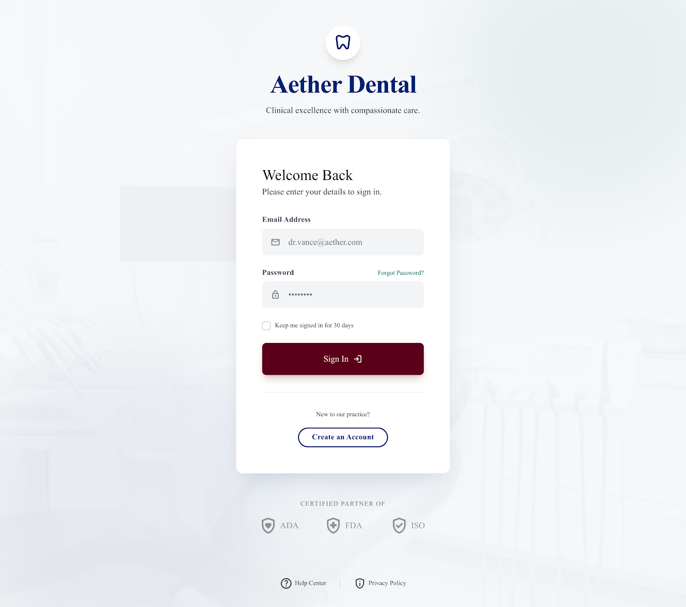

    
Register

    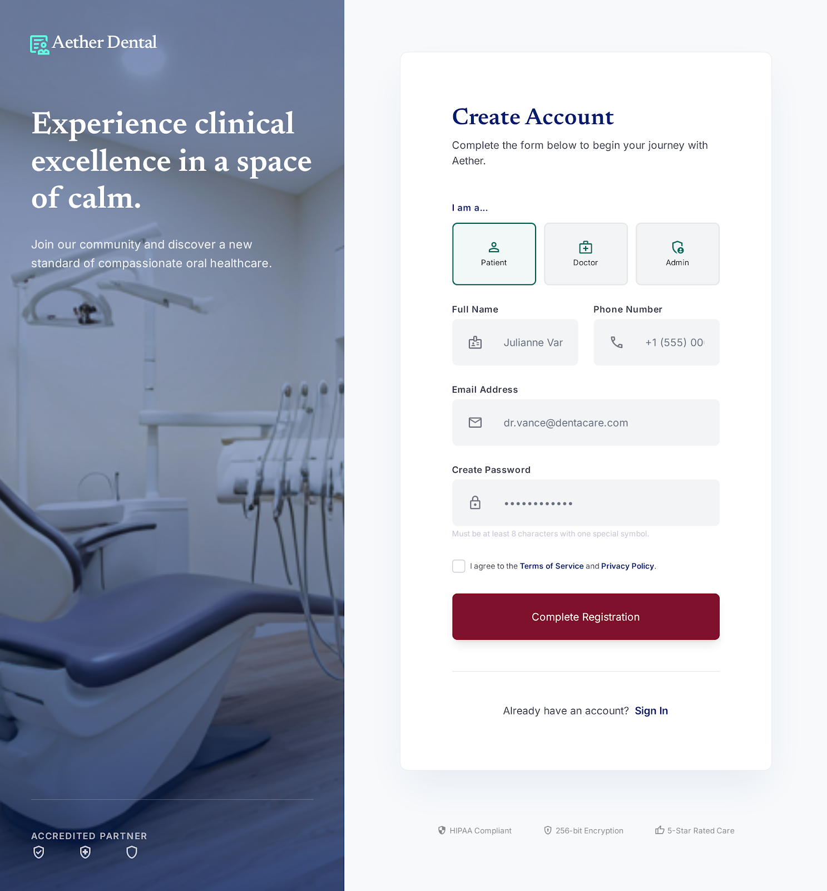

    
Doctor Dashboard

    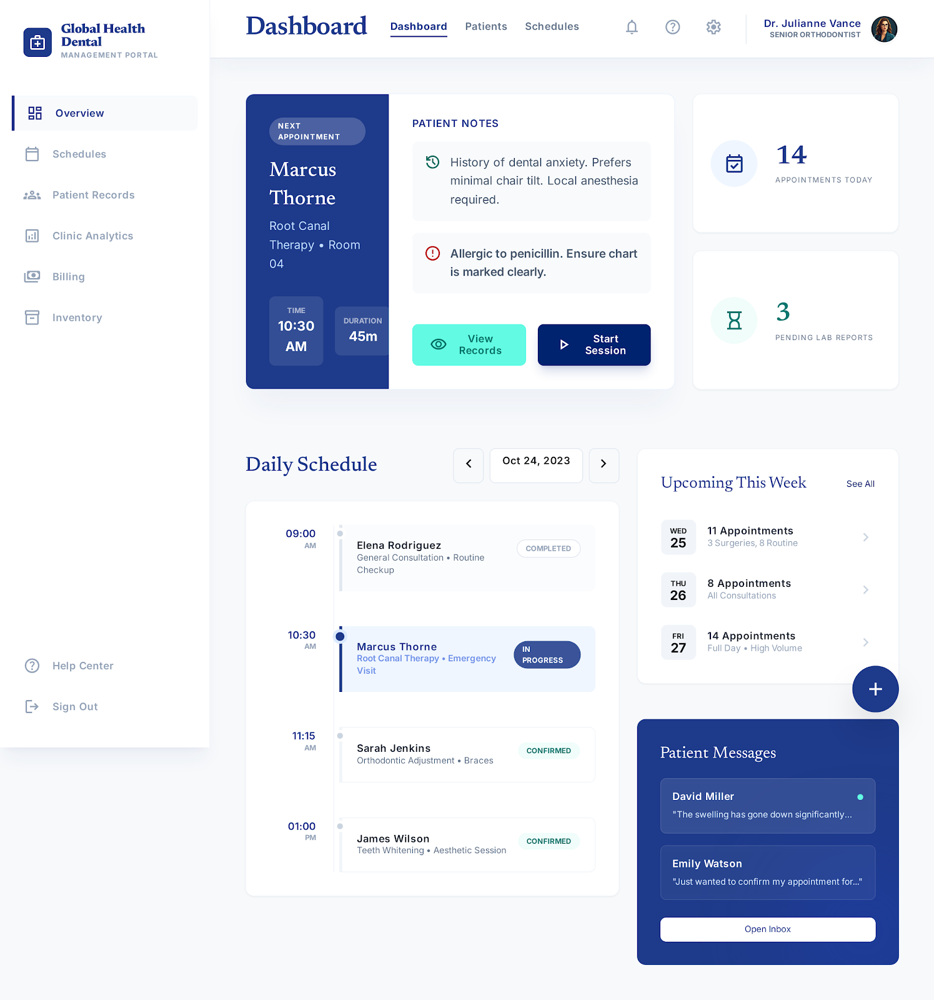

    
Admin Dashboard

    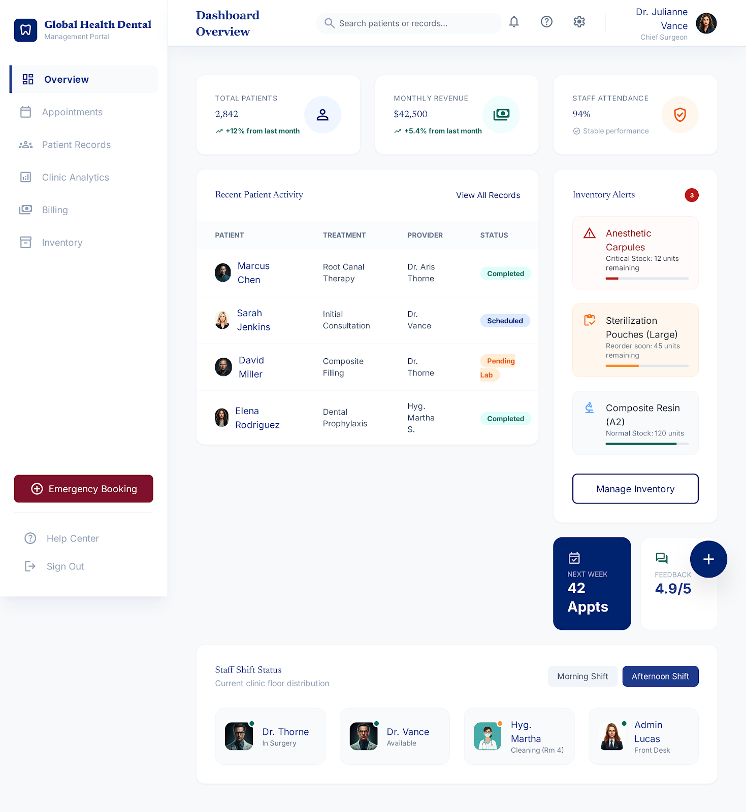

    
Patient Dashboard

    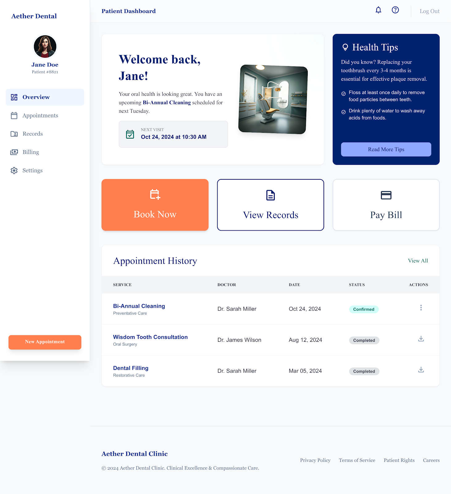

    
Patient Portal

    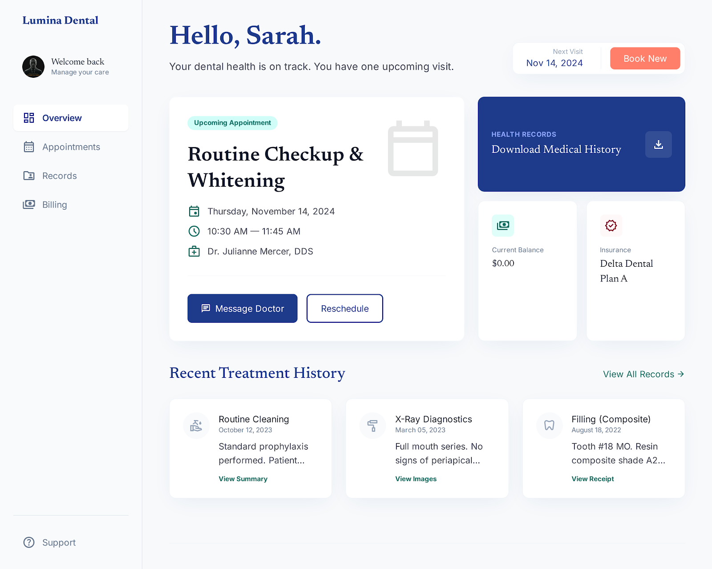

    

        
Landing Page

        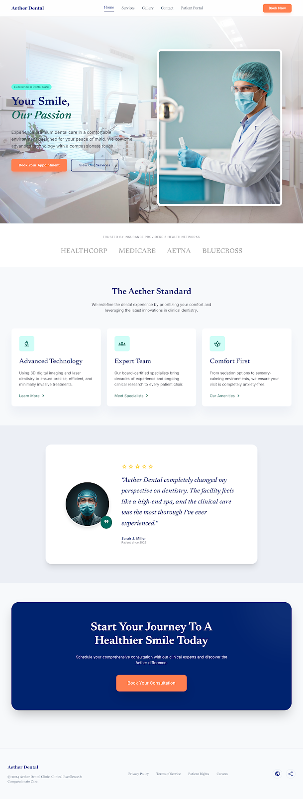
    

    

        
Patient History

        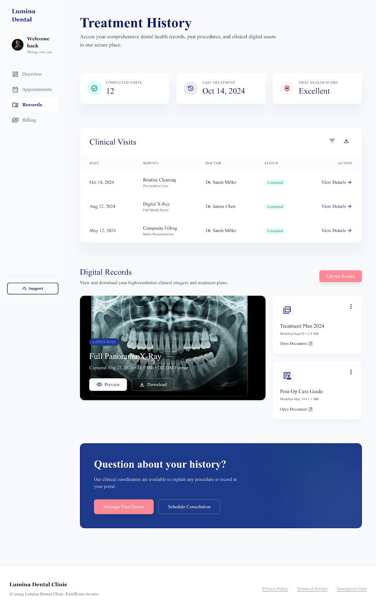
    

    
Services

    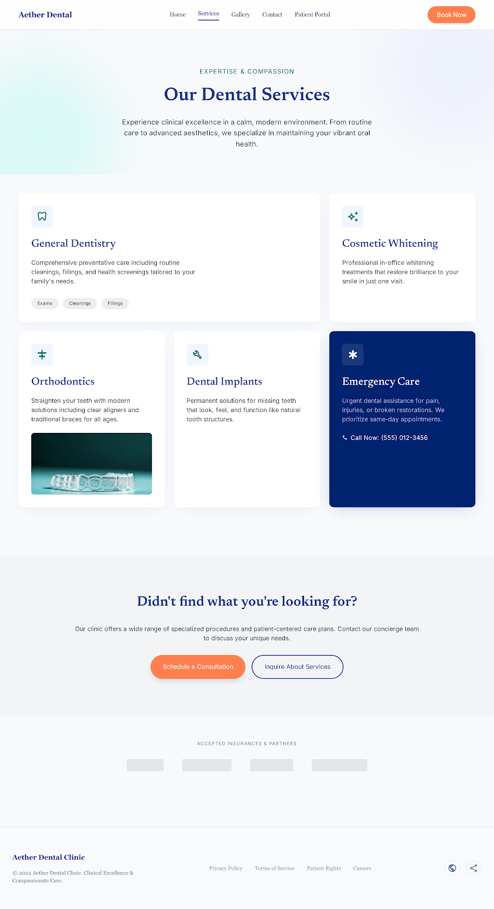

    
Contact us

    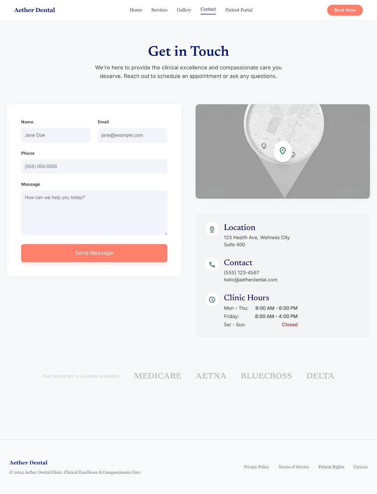

    
Gallery

    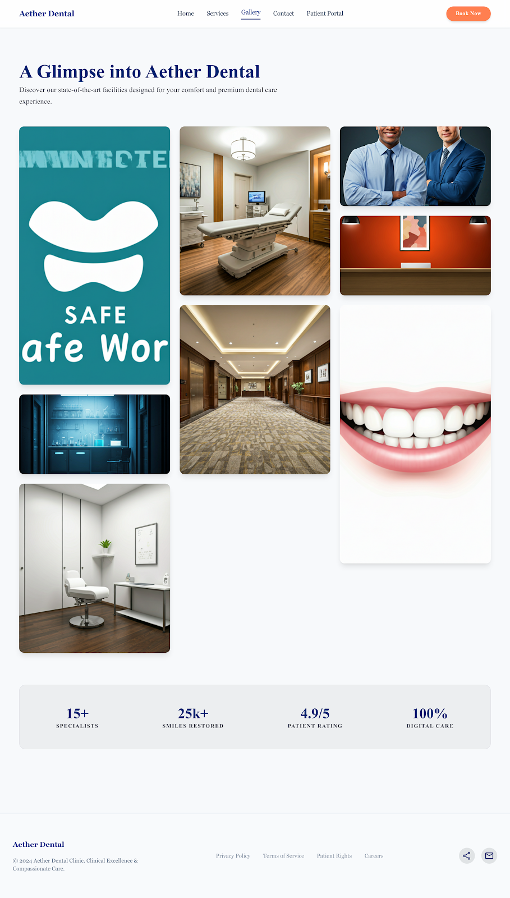

[← Back to Documentation Index](./README.md)